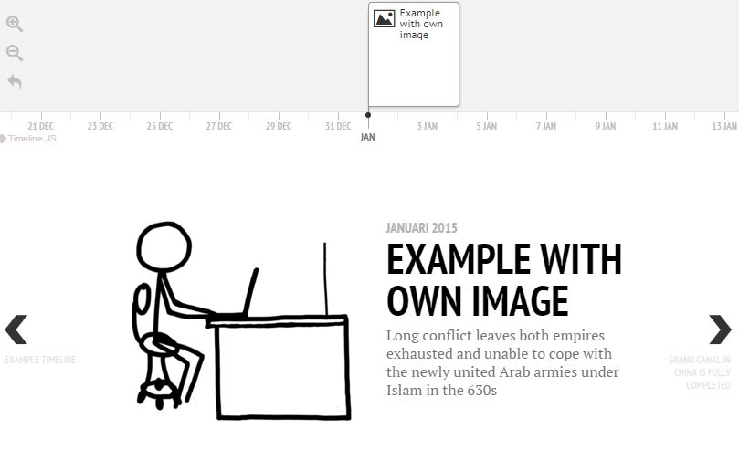
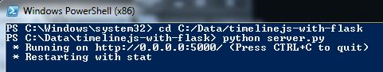

# timelinejs-with-flask
Example implementation of using TimelineJS3 with Flask. Can be used as a base template to quickly create your own template. 
Uses [TimelineJS3](https://github.com/NUKnightLab/TimelineJS3) and [Flask](http://flask.pocoo.org) to create and host an interactive timeline. 

## What does it look like? 



## Installation

Install Python and Flask. I recommend using the [Anaconda](http://continuum.io/downloads) distribution, which has flask included. 
If you already have Python, use
```python
pip install Flask
```

To start the application, open a shell and CD into the directory where you cloned this repository. Then start the application: 
```bash
cd ~/timelinejs-with-flask
python server.py
```

In windows, running the application looks like this:



To view your application, browse to _http://localhost:5000_

## Sharing your application

Look up your IP address, and add the port number (5000). In windows, you can find your ip adress by typing `ipconfig` in a cmd shell. 

## How to extend

- Use _/static/img_ to place your images.
- Use _/static/data/events.json_ to specify your events.
- Use _/templates/index.html_ to edit the page name.

See the [TimelineJS3 documentation](http://timeline.knightlab.com/docs/options.html) for more options. Have a look at the [Flask Quickstart](http://flask.pocoo.org/docs/0.10/quickstart/) to learn more about flask. 
